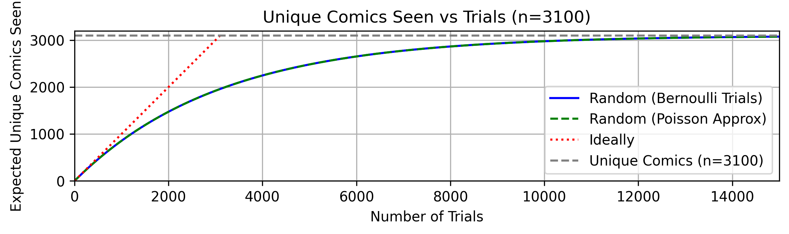

## minimal xkcd viewer **with read tracking**.

## Cold Open

After years of using the "random" button, I realized I've lost track of which comics I have and haven't read. While a random comic I would likely have seen before, I knew there were still many comics I haven't seen.

Mathematically, this predicament is the [occupancy](https://en.wikipedia.org/wiki/Occupancy_problem) or [coupon collector's](https://en.wikipedia.org/wiki/Coupon_collector%27s_problem) problem. To see every comic, I can expect to click the "random" button far more (26700) than the actual number of comics (3100).

It's much more efficient to track the comics I have and haven't read. Sure, I could read the comics in order. But I also enjoy the freedom to read comics at will, in no particular order.

After experimenting with existing options, I bit the bullet and made my own xkcd viewer. I know there are other XKCD browsers (unixkcd, xkcd.wtf, [etc](https://www.explainxkcd.com/wiki/index.php/Browser_helpers), [etc](https://www.explainxkcd.com/wiki/index.php/explain_xkcd:Community_portal/Admin_requests#XKCD_Browser)), but surprisingly none of them tackles tracking read progress (to my knowledge).

- Minimal
- No ads, ever
- Entirely in browser
- Open source
- Calendar view
- Quick links to explainxkcd
- Easy import/export
- Alerts interactive comics
- Alt text (for mobile)

## Notable Features

- Hovering over the comic title reveals the publication date.
- The footer links to the corresponding xkcd and explainxkcd pages.
- Alterations to the header (present in [#1047](https://xkcd.com/1047/) et al.) are easy to miss. Here, they are displayed alongside the alt text.

## License

As stated on xkcd.com, Randall's comics are [CC BY-NC 2.5](https://creativecommons.org/licenses/by-nc/2.5/), except #343 and #739 ([CC BY-SA 3.0](https://creativecommons.org/licenses/by-sa/3.0/deed.en)) The XKCD reader code is MIT licensed. Randall, if you're reading this -- I'd love to chat!

## Credits

The favicon is from explainxkcd.com, a phenomenal resource. And of course, huge thanks to Randall Munroe for the great webcomic -- and graciously making this all possible.
